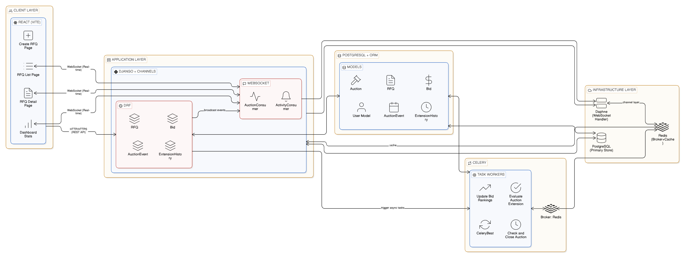

# High-Level Design (HLD) - British Auction RFQ System

## Executive Summary

A distributed four-tier web application for managing British-style auctions with dynamic bid-triggered extensions. The system handles real-time bidding, automatic auction extensions, and comprehensive bid ranking with WebSocket-powered live updates.

---

## 1. System Architecture Overview




### 1.1 Architecture Diagram Overview
```
┌─────────────────────────────────────────────────────────────────────────┐
│                            Client Layer                                  │
│                      React Frontend (Vite)                              │
│  ┌──────────────┐  ┌──────────────┐  ┌──────────────┐  ┌────────────┐ │
│  │   RFQ List   │  │   RFQ Detail │  │  Create RFQ  │  │  Dashboard │ │
│  │   Page       │  │   Page       │  │  Page        │  │  Stats     │ │
│  └──────────────┘  └──────────────┘  └──────────────┘  └────────────┘ │
│         │                  │                  │               │          │
│         └──────────────────┴──────────────────┴───────────────┘          │
│                            │                                             │
│            HTTP/HTTPS (REST API) │ WebSocket (Real-time)                │
└────────────────────────────┼──────────────────────────────────────────┘
                             │
        ┌────────────────────┴────────────────────┐
        ▼                                          ▼
┌──────────────────────────────────────────────────────────────────────────┐
│                         Application Layer                                │
│                      Django + Django Channels                            │
│  ┌─────────────────────────────────┐  ┌──────────────────────────────┐  │
│  │   REST API Layer (DRF)          │  │   WebSocket Layer            │  │
│  │  ┌───────────────────────────┐  │  │   (Django Channels)          │  │
│  │  │ RFQViewSet                │  │  │  ┌────────────────────────┐  │  │
│  │  │ - List/Create/Retrieve    │  │  │  │ AuctionConsumer        │  │  │
│  │  │ - Activate/Close          │  │  │  │ - Group Management     │  │  │
│  │  │ - Statistics              │  │  │  │ - Real-time Updates    │  │  │
│  │  │                           │  │  │  │ - Event Broadcasting   │  │  │
│  │  ├───────────────────────────┤  │  │  └────────────────────────┘  │  │
│  │  │ BidViewSet                │  │  │                              │  │
│  │  │ - Submit Bid              │  │  │  ┌────────────────────────┐  │  │
│  │  │ - List Bids               │  │  │  │ ActivityConsumer       │  │  │
│  │  │ - Bid Ranking             │  │  │  │ - Activity Feed        │  │  │
│  │  │                           │  │  │  │ - User Notifications   │  │  │
│  │  ├───────────────────────────┤  │  │  └────────────────────────┘  │  │
│  │  │ AuctionEventViewSet       │  │  │                              │  │
│  │  │ - Event Log (Read-only)   │  │  │                              │  │
│  │  │                           │  │  │                              │  │
│  │  ├───────────────────────────┤  │  │                              │  │
│  │  │ ExtensionHistoryViewSet   │  │  │                              │  │
│  │  │ - Extension Tracking      │  │  │                              │  │
│  │  │   (Read-only)             │  │  │                              │  │
│  │  └───────────────────────────┘  │  │                              │  │
│  └─────────────────────────────────┘  └──────────────────────────────┘  │
│                 │                              │                        │
│                 │ Triggers Async Tasks         │ Broadcasts Events      │
│                 └──────────────┬───────────────┘                        │
│                                │                                        │
└────────────────────────────────┼────────────────────────────────────────┘
                                 │
        ┌────────────────────────┴────────────────────┐
        ▼                                             ▼
┌──────────────────────────┐              ┌──────────────────────────┐
│    Message Queue Layer   │              │   Persistence Layer      │
│        (Celery)          │              │    (PostgreSQL + ORM)    │
│  ┌────────────────────┐  │              │  ┌────────────────────┐  │
│  │ Task Workers       │  │              │  │ Models:            │  │
│  │                    │  │              │  │ - RFQ              │  │
│  │ • evaluate_auction │  │              │  │ - Auction          │  │
│  │   _extension       │  │              │  │ - Bid              │  │
│  │                    │  │              │  │ - AuctionEvent     │  │
│  │ • update_bid_      │  │              │  │ - ExtensionHistory │  │
│  │   rankings         │  │              │  │ - User             │  │
│  │                    │  │              │  └────────────────────┘  │
│  │ • check_and_close_ │  │              │                          │
│  │   auction          │  │              │                          │
│  │                    │  │              │                          │
│  │ • periodic_check   │  │              │                          │
│  │   (CeleryBeat)     │  │              │                          │
│  └────────────────────┘  │              │                          │
│         │                │              │                          │
│         └─ Broker: Redis │              │                          │
└──────────────────────────┘              └──────────────────────────┘

┌──────────────────────────────────────────────────────────────────────────┐
│                      Infrastructure Layer                                │
│  ┌──────────────────┐  ┌──────────────────┐  ┌────────────────────────┐ │
│  │   Redis Server   │  │  PostgreSQL DB   │  │  Daphne ASGI Server   │ │
│  │  (Broker+Cache)  │  │  (Primary Store) │  │  (WebSocket Handler)  │ │
│  └──────────────────┘  └──────────────────┘  └────────────────────────┘ │
└──────────────────────────────────────────────────────────────────────────┘
```

### 1.2 Tier Breakdown

| Tier            | Component             | Technology                   | Purpose                            |
| --------------- | --------------------- | ---------------------------- | ---------------------------------- |
| **Client**      | React SPA             | React 18, Vite, Tailwind CSS | User Interface & Interactions      |
| **Application** | Django REST API       | Django 4.2, DRF, Channels    | Business Logic & Real-time Updates |
| **Messaging**   | Celery Worker Pool    | Celery, Redis                | Async Task Processing & Scheduling |
| **Data**        | PostgreSQL + ORM      | Django ORM, psycopg2         | Persistent Storage                 |
| **Real-time**   | Redis + Channel Layer | Redis, Channels              | Pub/Sub for WebSocket Broadcasting |

---

## 2. Core Components

### 2.1 Frontend Layer (React + Vite)

#### 2.1.1 Architecture

```
Frontend Application
├── Pages
│   ├── AuctionListPage        # Browse RFQs with filters & search
│   ├── AuctionDetailPage      # View RFQ details, bids, events
│   ├── CreateRFQPage          # Create new RFQ with config
│   ├── SubmitBidPage          # Submit bids on RFQs
│   └── NotFoundPage           # 404 handling
├── Components
│   └── Navbar                 # Navigation & branding
├── Hooks
│   └── useAuction             # RFQ & auction state management
├── API
│   └── client.js              # Axios HTTP client
├── Utils
│   └── helpers.js             # Utility functions
└── WebSocket Handler          # Real-time updates
```

#### 2.1.2 Key Technologies

- **React 18**: Functional components with hooks
- **React Router v6**: Client-side routing & navigation
- **Axios**: HTTP REST client for API calls
- **Tailwind CSS**: Utility-first CSS framework
- **date-fns**: Date formatting & manipulation
- **Lucide React**: Icon library

#### 2.1.3 Features

- Real-time bid updates via WebSocket
- Responsive design (mobile-first approach)
- Status filtering & search capabilities
- Pagination for large datasets
- Live auction countdown timers
- Extension notifications

---

### 2.2 Backend Application Layer (Django REST)

#### 2.2.1 REST API Architecture

```
API Endpoints Structure:
/api/v1/
├── /rfqs/                          # RFQ Management
│   ├── GET     (List with filters)
│   ├── POST    (Create)
│   ├── /{id}/
│   │   ├── GET      (Retrieve detail)
│   │   ├── PATCH    (Update)
│   │   ├── DELETE   (Delete)
│   │   ├── POST activate           (Activate RFQ)
│   │   ├── POST close              (Close RFQ)
│   │   ├── GET /bids               (Get RFQ bids)
│   │   ├── GET /events             (Get auction events)
│   │   ├── GET /extension_history  (Get extensions)
│   │   └── GET /statistics         (Get auction stats)
├── /bids/                          # Bid Management
│   ├── GET     (List bids)
│   ├── POST    (Submit bid)
│   └── /{id}
│       ├── GET  (Retrieve bid)
│       ├── PATCH (Update bid)
│       └── DELETE (Delete bid)
├── /auction-events/               # Event Log (Read-only)
│   ├── GET     (List events)
│   └── /{id}
│       └── GET  (Retrieve event)
└── /extension-history/            # Extension Log (Read-only)
    ├── GET     (List extensions)
    └── /{id}
        └── GET  (Retrieve extension)
```

#### 2.2.2 ViewSets & Serializers

**RFQViewSet**

```python
Actions:
- list()              # List all RFQs with filtering
- create()            # Create new RFQ (validates timing)
- retrieve()          # Get RFQ detail with related data
- activate()          # Change status from draft→active
- close()             # Close RFQ (manual)
- statistics()        # Get bid statistics

Permissions: AllowAny (can be restricted)
Filters: status, created_by, search (reference_id, name)
Ordering: created_at, bid_close_time
```

**BidViewSet**

```python
Actions:
- list()              # List bids (with RFQ filter)
- create()            # Submit new bid (validates timing)
- retrieve()          # Get bid detail
- update()            # Update bid
- destroy()           # Delete bid

Permissions: AllowAny (can be restricted)
Filters: rfq, supplier, ranking
```

**Serializers**

- `RFQCreateSerializer`: Validates RFQ timing constraints
- `RFQListSerializer`: Simplified RFQ view (list endpoint)
- `RFQDetailSerializer`: Full RFQ with bids, events, extensions
- `BidCreateSerializer`: Validates bid submission timing
- `BidSerializer`: Bid display with ranking info
- `AuctionEventSerializer`: Event log display
- `ExtensionHistorySerializer`: Extension tracking

#### 2.2.3 Core Models

```python
RFQ (Request for Quotation)
├── id: UUID (PK)
├── reference_id: String (unique, indexed)
├── name: String
├── created_by: ForeignKey(User)
├── bid_start_time: DateTime
├── bid_close_time: DateTime
├── forced_close_time: DateTime
├── pickup_date: Date
├── status: Choice['draft','active','closed','force_closed','awarded']
├── created_at: DateTime (auto)
├── updated_at: DateTime (auto)
└── Indexes: [reference_id, status, bid_close_time]

Auction (British Auction Configuration)
├── id: UUID (PK)
├── rfq: OneToOneField(RFQ)
├── trigger_window_mins: Integer (default: 10)
├── extension_duration_mins: Integer (default: 5)
├── trigger_type: Choice['bid','rank_change','l1_change']
├── current_close_time: DateTime (nullable)
├── last_extension_at: DateTime (nullable)
├── extension_count: Integer
├── created_at: DateTime (auto)
└── updated_at: DateTime (auto)

Bid
├── id: UUID (PK)
├── rfq: ForeignKey(RFQ)
├── supplier: ForeignKey(User)
├── bid_amount: Decimal
├── total_charges: Decimal
├── submitted_at: DateTime
├── current_rank: Integer (nullable)
├── previous_rank: Integer (nullable)
├── created_at: DateTime (auto)
└── updated_at: DateTime (auto)

AuctionEvent (Event Log)
├── id: UUID (PK)
├── rfq: ForeignKey(RFQ)
├── event_type: Choice['extended','closed','bid_submitted','rank_change']
├── bid: ForeignKey(Bid, nullable)
├── description: String
├── metadata: JSONField
├── created_at: DateTime (auto)

ExtensionHistory
├── id: UUID (PK)
├── rfq: ForeignKey(RFQ)
├── prev_close_time: DateTime
├── new_close_time: DateTime
├── trigger_reason: String
├── trigger_bid: ForeignKey(Bid)
├── duration_mins: Integer
└── created_at: DateTime (auto)
```

---

### 2.3 WebSocket Layer (Django Channels)

#### 2.3.1 Real-time Communication Architecture

```
WebSocket Consumer Groups:

auction_{rfq_id}
├── Connected Clients
├── Message Types:
│   ├── auction_extended         (Extension triggered)
│   ├── bid_submitted            (New bid received)
│   ├── rank_changed             (Bid ranking updated)
│   ├── auction_closed           (Auction ended)
│   ├── activity_feed            (User activity)
│   └── pong                     (Connection keepalive)
└── Broadcast Source: Celery tasks

routing.py
├── WebSocket URL: ws://domain/ws/auction/{rfq_id}/
└── AuthMiddleware: Session/Token validation
```

#### 2.3.2 Consumers

**AuctionConsumer**

- Handles auction-specific WebSocket connections
- Groups users by `rfq_id` for targeted broadcasts
- Receives: ping, subscribe, unsubscribe messages
- Broadcasts: extension events, bid updates, rank changes

**ActivityConsumer** (if implemented)

- Handles activity feed updates
- User-specific notifications
- General auction activity stream

#### 2.3.3 Message Flow

```
1. User submits bid via HTTP POST
   ↓
2. BidViewSet.create() validates & saves
   ↓
3. Triggers Celery task: evaluate_auction_extension(rfq_id, bid_id)
   ↓
4. Celery worker evaluates extension logic
   ↓
5. If extension occurs:
   - Update Auction.current_close_time
   - Create ExtensionHistory record
   - Create AuctionEvent
   - Call broadcast_auction_update()
   ↓
6. broadcast_auction_update() sends WebSocket message to auction_{rfq_id} group
   ↓
7. All connected clients receive real-time update
   ↓
8. Frontend updates UI (new close time, extension count)
```

---

### 2.4 Celery Task Queue Layer

#### 2.4.1 Task Architecture

```
Celery Setup
├── Broker: Redis (message queue)
├── Result Backend: Redis (optional)
├── Workers: Multiple async processors
└── Beat: Periodic task scheduler (celerybeat)
```

#### 2.4.2 Core Tasks

**1. evaluate_auction_extension** (Async, Triggered on Bid Submit)

```
Purpose: Core auction extension logic
Trigger: When new bid submitted
Logic:
  a) Get RFQ and Bid
  b) Check if bid within trigger_window (last 10 mins before close)
  c) Determine trigger reason:
     - 'bid': Any bid in trigger window
     - 'rank_change': Bid changed any ranking
     - 'l1_change': Bid changed lowest bidder (L1)
  d) If should extend:
     - Calculate: new_close_time = current_close_time + extension_duration_mins
     - Ensure: new_close_time ≤ forced_close_time
     - Update: Auction.current_close_time, extension_count
     - Create: ExtensionHistory record
     - Create: AuctionEvent log entry
     - Broadcast: WebSocket update to all connected clients
  e) Return: {extended: bool, reason: str, metadata: dict}
Retry: Up to 3 times on failure
Max retries: 3
```

**2. update_bid_rankings** (Async, Triggered on Bid Submit/Update)

```
Purpose: Recalculate bid rankings
Trigger: After bid submission or update
Logic:
  a) Get all bids for RFQ
  b) Sort by: total_charges (ascending)
  c) Assign rankings: 1, 2, 3, ... N
  d) Detect rank changes:
     - If current_rank ≠ previous_rank → rank change event
     - If newly L1 (rank=1) → L1 change event
  e) Create AuctionEvent for rank changes
  f) Broadcast rank update events
  g) Create activity log entries
Return: {updated_count: int, rank_changes: list}
```

**3. check_and_close_auction** (Periodic or Triggered)

```
Purpose: Automatically close auctions past close time
Trigger: Periodic task (e.g., every 5 minutes) + on activation
Logic:
  a) Query: Auctions with current_close_time ≤ now
  b) For each auction:
     - Determine winner (lowest bidder)
     - Update RFQ status: 'closed' or 'awarded'
     - Create AuctionEvent: 'auction_closed'
     - Broadcast: WebSocket 'auction_closed' message
     - Notify winner (optional email/notification)
  c) Return: {closed_count: int, winners: list}
```

**4. periodic_check** (Celery Beat)

```
Purpose: Background monitoring task
Schedule: Every 5 minutes (configurable)
Logic:
  a) Check for auctions needing closure
  b) Clean up stale WebSocket connections
  c) Generate reports/metrics
  d) Trigger maintenance tasks
```

#### 2.4.3 Task Workflow Diagram

```
User Action          Task Triggered              Result
─────────────────────────────────────────────────────────
Submit Bid ──→ evaluate_auction_extension ──→ Extension logic
    ↓                      ↓                        ↓
    └─→ update_bid_rankings ──→ Rank recalculation
         ↓                          ↓
         └──→ broadcast_auction_update ──→ WebSocket
              (triggered by tasks)          (to frontend)

CeleryBeat      check_and_close_auction ──→ Auto-close expired
(Periodic) ──→  periodic_check             auctions

```

---

## 3. Data Flow Patterns

### 3.1 Bid Submission Flow

```
┌─────────────┐
│ Frontend    │
│ Submit Bid  │
└──────┬──────┘
       │ HTTP POST /bids/
       ▼
┌─────────────────────────────────────────┐
│ BidViewSet.create()                     │
│ ├─ Validate bid timing                  │
│ ├─ Validate bid amount                  │
│ ├─ Check RFQ status = 'active'          │
│ └─ Save Bid to DB                       │
└──────┬──────────────────────────────────┘
       │ Saves to PostgreSQL
       ▼
┌─────────────────────────────────────────┐
│ PostgreSQL                              │
│ Inserts: Bid record                     │
│ Updates: RFQ.updated_at                 │
└──────┬──────────────────────────────────┘
       │
       │ Returns Bid object + HTTP 201
       │
       ▼ (Signal/Hook)
┌─────────────────────────────────────────┐
│ Django Signal: post_save(Bid)           │
│ Triggers async tasks:                   │
│ └─ evaluate_auction_extension()         │
│ └─ update_bid_rankings()                │
└──────┬──────────────────────────────────┘
       │ Pushes to Redis Queue
       ▼
┌─────────────────────────────────────────┐
│ Celery Workers                          │
│ ├─ Evaluate extension logic             │
│ ├─ If triggered: update current_close   │
│ ├─ Create ExtensionHistory              │
│ ├─ Create AuctionEvent                  │
│ └─ Recalculate rankings                 │
└──────┬──────────────────────────────────┘
       │
       ├─→ Updates PostgreSQL
       │   (extension_count, rankings)
       │
       └─→ broadcast_auction_update()
           (via channel layer)
           ▼
        ┌─────────────────────────────────────────┐
        │ Redis Channel Layer                     │
        │ Publishes to: auction_{rfq_id}          │
        └──────┬──────────────────────────────────┘
               │
               ▼ (Message routed to group)
        ┌─────────────────────────────────────────┐
        │ AuctionConsumer (WebSocket)             │
        │ ├─ Receives: auction_extended           │
        │ ├─ Receives: rank_changed               │
        │ └─ Broadcasts to all group members      │
        └──────┬──────────────────────────────────┘
               │ WebSocket messages
               ▼
        ┌─────────────────────────────────────────┐
        │ Frontend Clients                        │
        │ ├─ Update bid list                      │
        │ ├─ Update close time                    │
        │ ├─ Update rankings                      │
        │ └─ Show notifications                   │
        └─────────────────────────────────────────┘
```

### 3.2 Auction Extension Logic

```
BID SUBMITTED → evaluate_auction_extension() task
                      │
                      ▼
              Current Time Check
                      │
        ┌─────────────┴──────────────┐
        │                            │
        NO                           YES
   (Outside Window)              (In Window)
        │                            │
        └─→ Return                   ▼
        {extended: false}    Evaluate Trigger Type
                                    │
                ┌───────────────────┼───────────────────┐
                │                   │                   │
            'bid'               'rank_change'       'l1_change'
         Extend always       Check if changed    Check if new L1
                │            any ranking            │
                │                  │                │
                └─→ should_extend = true ←──────────┘
                      │
                      ▼
                 Can Extend?
              (< forced_close)
                      │
        ┌─────────────┴────────────────┐
        │                              │
       YES                             NO
        │                              │
        ▼                              └─→ Return
    Extend:                        {extended: false,
    ├─ new_close_time            reason: 'reached_forced_close'}
    ├─ increment extension_count
    ├─ save Auction
    └─ create ExtensionHistory
         │
         ├─→ Create AuctionEvent
         │
         └─→ broadcast_auction_update()
                      │
                      ▼
            WebSocket to all clients
                      │
                      ▼
             Frontend shows:
             ├─ New close time
             ├─ Extension count
             └─ Notification

```

### 3.3 Auction Auto-Close Flow

```
CeleryBeat Schedule (Every 5 mins)
         │
         ▼
check_and_close_auction() task
         │
         ▼
Query: SELECT * FROM auction
       WHERE current_close_time ≤ NOW()
       AND rfq.status = 'active'
         │
         ▼
For each expired auction:
         │
         ├─ Find winner (MIN(total_charges))
         │
         ├─ Update RFQ.status → 'awarded'/'closed'
         │
         ├─ Create AuctionEvent('closed')
         │
         ├─ broadcast_auction_update()
         │   {type: 'auction_closed', winner: {...}}
         │
         └─ Optional: Send notifications
              └─ Email winner
              └─ Email other suppliers
              └─ WebSocket notification
```

---

## 4. Key Features & Business Logic

### 4.1 British Auction Features

#### 4.1.1 Automatic Extension on Bid Activity

```
Trigger Window: Last 10 minutes before close time
When triggered:
- Auction extends by 5 minutes (configurable)
- Cannot exceed forced_close_time
- Multiple extensions possible
- All connected clients notified in real-time

Extension reasons:
- Any bid received (if trigger_type='bid')
- Rank changed (if trigger_type='rank_change')
- L1 changed (if trigger_type='l1_change')
```

#### 4.1.2 Dynamic Bid Ranking

```
Ranking Logic:
1. Sort all bids by total_charges (ascending)
2. Assign rank: 1=lowest, 2=second-lowest, etc.
3. Detect rank changes:
   - Notify when bid moves up/down in ranking
   - Trigger extension if L1 changes (rank=1)
4. Display real-time rankings to all clients
```

#### 4.1.3 Auction Lifecycle

```
States:
- draft: Initial state, not active for bidding
- active: Accepting bids, real-time updates
- closed: Past bid_close_time or manually closed
- force_closed: Past forced_close_time
- awarded: Winner determined

Transitions:
draft ──→ active ──→ closed ──→ awarded
         (activate)   (auto or   (winner
                      manual)    assigned)
```

### 4.2 Real-time Features

#### 4.2.1 WebSocket Broadcasting

- Extension events reach all clients <100ms latency
- Bid rankings update immediately
- Auction close notifications
- User-specific activity feeds

#### 4.2.2 Connection Management

- Auto-reconnect on disconnect
- Ping/pong keep-alive mechanism
- Group-based message routing (no spam to unrelated users)
- Graceful degradation if WebSocket unavailable

---

## 5. Scalability & Performance Considerations

### 5.1 Horizontal Scaling Architecture

```
Load Balancer (NGINX/HAProxy)
         │
    ┌────┴────┐
    │          │
    ▼          ▼
Django App  Django App    (Multiple instances)
    │          │
    └────┬─────┘
         │
    PostgreSQL
    (Primary DB)
         │
    ┌────┴────┐
    │          │
    ▼          ▼
Redis     Redis Replica   (HA cluster)
    │
    └─ Celery Workers (Multiple instances)
```

### 5.2 Performance Optimization Strategies

**Database**

- Indexes on: reference_id, status, bid_close_time, rfq_id
- Connection pooling (via psycopg2)
- Query optimization with select_related/prefetch_related
- Pagination for list endpoints (default: 20 items/page)

**Caching**

- Redis cache for frequently accessed RFQs
- Cache invalidation on updates
- Session caching for user preferences

**Task Queue**

- Async processing prevents blocking
- Task retries with exponential backoff
- Priority queue for time-sensitive tasks

**WebSocket**

- Connection limit per server: ~10,000 concurrent
- Message batching for bulk updates
- Selective broadcasting (group-based)

---

## 6. Security Considerations

### 6.1 Authentication & Authorization

```
Current: AllowAny (demo mode)
Recommended:
├── JWT tokens for API authentication
├── Session-based for WebSocket
├── Role-based access control (RBAC)
│   ├── Supplier: View auctions, submit bids
│   ├── Buyer: Create auctions, view results
│   └── Admin: Full access
└── Permissions:
    ├── RFQ creation: Only authenticated users
    ├── Bid submission: Only suppliers on active auctions
    ├── RFQ closure: Only creator or admin
    └── Data access: Role-based filtering
```

### 6.2 API Security

- **HTTPS/TLS**: Encrypt all data in transit
- **CORS**: Restrict to known domains
- **Rate Limiting**: Prevent abuse (e.g., 100 req/min per IP)
- **Input Validation**: Sanitize all user inputs
- **SQL Injection Prevention**: Use ORM (Django ORM handles this)
- **CSRF Protection**: Django middleware enabled
- **API Versioning**: /api/v1/, /api/v2/ for backward compatibility

### 6.3 Data Protection

- **Database Encryption**: At-rest encryption for PostgreSQL
- **Secrets Management**: Environment variables, no hardcoded secrets
- **Audit Logging**: All critical operations logged
- **Data Retention**: Define archival & deletion policies
- **Backup Strategy**: Daily backups with point-in-time recovery

### 6.4 WebSocket Security

- **Origin Validation**: Check Referer/Origin headers
- **Message Size Limits**: Prevent large payload attacks
- **Connection Limits**: Rate limit new connections
- **Timeout**: Disconnect idle connections (>30 mins)

---

## 7. API Response Formats

### 7.1 Success Response Format

```json
{
  "id": "uuid",
  "reference_id": "RFQ-001",
  "name": "Auction Title",
  "status": "active",
  "bid_close_time": "2026-04-26T15:00:00Z",
  "current_close_time": "2026-04-26T15:05:00Z",
  "extension_count": 2,
  "bids": [
    {
      "id": "uuid",
      "supplier": "Supplier Name",
      "total_charges": 1000.0,
      "current_rank": 1,
      "submitted_at": "2026-04-26T14:55:00Z"
    }
  ],
  "created_at": "2026-04-26T10:00:00Z",
  "updated_at": "2026-04-26T14:58:00Z"
}
```

### 7.2 Error Response Format

```json
{
  "error": "Validation Error",
  "detail": "Bid amount must be less than 10000",
  "status_code": 400,
  "timestamp": "2026-04-26T14:58:00Z"
}
```

### 7.3 WebSocket Message Format

```json
{
  "type": "auction_extended",
  "rfq_id": "uuid",
  "old_close_time": "2026-04-26T15:00:00Z",
  "new_close_time": "2026-04-26T15:05:00Z",
  "extension_count": 2,
  "trigger_reason": "bid",
  "timestamp": "2026-04-26T14:58:30Z"
}
```

---

## 8. Deployment Architecture

### 8.1 Development Environment

```
Local Machine
├── Django Dev Server (runserver)
├── Redis (local)
├── PostgreSQL (local)
├── Celery Worker (local)
├── CeleryBeat (local)
└── React Dev Server (Vite, port 5173)
```

### 8.2 Production Environment

```
Production Infrastructure
┌─────────────────────────────────────────────────┐
│ CDN / Static Asset Delivery (CloudFront/etc)    │
│ └─ Serves: JS bundles, CSS, images              │
└─────────────────┬───────────────────────────────┘
                  │
┌─────────────────┴───────────────────────────────┐
│ Load Balancer (NGINX/ALB)                       │
│ ├─ SSL/TLS termination                          │
│ ├─ WebSocket routing to Daphne                  │
│ └─ HTTP routing to Django                       │
└─────────────────┬───────────────────────────────┘
                  │
    ┌─────────────┼─────────────┐
    │             │             │
    ▼             ▼             ▼
┌────────┐   ┌────────┐   ┌────────┐
│Django  │   │Django  │   │Django  │
│+       │   │+       │   │+       │
│Daphne  │   │Daphne  │   │Daphne  │
│App 1   │   │App 2   │   │App 3   │
└────────┘   └────────┘   └────────┘
    │             │             │
    └─────────────┼─────────────┘
                  │
        ┌─────────┴─────────┐
        │                   │
        ▼                   ▼
    ┌────────┐         ┌────────────┐
    │  RDS   │         │ Redis      │
    │Postgres│         │ Cluster    │
    │        │         │ (Sentinel) │
    └────────┘         └────────────┘
        │
        └─ Automated backups (S3/RDS)

    ┌──────────────────────────┐
    │ Celery Workers           │
    │ ├─ Worker 1             │
    │ ├─ Worker 2             │
    │ ├─ Worker 3             │
    │ └─ CeleryBeat (scheduler)│
    └──────────────────────────┘
```
---
## 9. Error Handling & Resilience

### 9.1 API Error Codes

```
200 OK                  - Successful request
201 Created             - Resource created
204 No Content          - Successful, no content
400 Bad Request         - Invalid input
401 Unauthorized        - Authentication required
403 Forbidden           - Permission denied
404 Not Found           - Resource not found
409 Conflict            - State conflict (e.g., RFQ not active)
422 Unprocessable       - Validation error
429 Too Many Requests   - Rate limited
500 Internal Error      - Server error
503 Unavailable         - Service unavailable
```

### 9.2 Task Failure Handling

```
Task Execution
    │
    ├─ Success → Complete
    │
    └─ Failure
       │
       ├─ Network error → Retry (exponential backoff)
       ├─ Task-specific error → Log & alert
       └─ Max retries exceeded → Dead letter queue
           │
           └─ Manual intervention required
```

### 9.3 Database Resilience

- Connection pooling for fault tolerance
- Automatic reconnection on failure
- Read replicas for load distribution
- Scheduled backups to S3
- Point-in-time recovery capability

---

## References

- [Django Documentation](https://docs.djangoproject.com/)
- [Django REST Framework](https://www.django-rest-framework.org/)
- [Django Channels](https://channels.readthedocs.io/)
- [Celery Documentation](https://docs.celeryproject.org/)
- [React Documentation](https://react.dev/)
- [PostgreSQL Documentation](https://www.postgresql.org/docs/)

---

**Document Version**: 1.0
**Last Updated**: April 26, 2026
