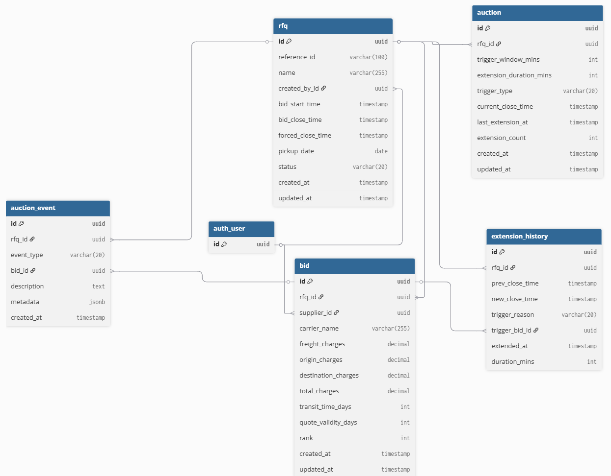

# Database Schema

## Overview

The British Auction RFQ system uses PostgreSQL with the following core tables:



## Tables

### RFQ Table

Stores Request for Quotation information.

- `id` (UUID, PK)
- `reference_id` (VARCHAR 100, UNIQUE) - Unique identifier
- `name` (VARCHAR 255) - RFQ name
- `created_by_id` (FK to User)
- `bid_start_time` (TIMESTAMP)
- `bid_close_time` (TIMESTAMP)
- `forced_close_time` (TIMESTAMP) - Never extended beyond this
- `pickup_date` (DATE)
- `status` (VARCHAR 20) - draft, active, closed, force_closed, awarded
- `created_at`, `updated_at` (TIMESTAMP)

**Constraints**: forced_close_time > bid_close_time

### Auction Table

Stores auction configuration and current state.

- `id` (UUID, PK)
- `rfq_id` (UUID, FK, UNIQUE) - One auction per RFQ
- `trigger_window_mins` (INT, default 10) - How many minutes before close to monitor
- `extension_duration_mins` (INT, default 5) - How many minutes to extend
- `trigger_type` (VARCHAR 20) - bid, rank_change, l1_change
- `current_close_time` (TIMESTAMP) - Dynamically updated with extensions
- `last_extension_at` (TIMESTAMP)
- `extension_count` (INT)
- `created_at`, `updated_at` (TIMESTAMP)

### Bid Table

Stores supplier quotes.

- `id` (UUID, PK)
- `rfq_id` (UUID, FK)
- `supplier_id` (FK to User)
- `carrier_name` (VARCHAR 255)
- `freight_charges`, `origin_charges`, `destination_charges` (DECIMAL)
- `total_charges` (DECIMAL, auto-computed)
- `transit_time_days` (INT)
- `quote_validity_days` (INT)
- `rank` (INT) - 1 = lowest, auto-computed
- `created_at`, `updated_at` (TIMESTAMP)

**Constraints**: total_charges = freight + origin + destination

### AuctionEvent Table

Activity log for each auction.

- `id` (UUID, PK)
- `rfq_id` (UUID, FK)
- `event_type` (VARCHAR 20) - bid_received, rank_changed, l1_changed, extended, closed, force_closed
- `bid_id` (UUID, FK, nullable)
- `description` (TEXT)
- `metadata` (JSONB) - Additional event data
- `created_at` (TIMESTAMP)

### ExtensionHistory Table

Tracks all extension events.

- `id` (UUID, PK)
- `rfq_id` (UUID, FK)
- `prev_close_time` (TIMESTAMP)
- `new_close_time` (TIMESTAMP)
- `trigger_reason` (VARCHAR 20) - bid, rank_change, l1_change, manual
- `trigger_bid_id` (UUID, FK, nullable) - Which bid triggered
- `extended_at` (TIMESTAMP)
- `duration_mins` (INT)

## Key Relationships

```
User (auth_user)
  ├─ created_by ──→ RFQ (1:N)
  └─ supplier ──→ Bid (1:N)

RFQ
  ├─ auction (1:1) ──→ Auction
  ├─ bids (1:N) ──→ Bid
  ├─ events (1:N) ──→ AuctionEvent
  └─ extension_history (1:N) ──→ ExtensionHistory

Bid
  └─ trigger_event ←─ ExtensionHistory (N:1)
```

## Business Rules

1. **Unique Constraint**: Each RFQ has unique reference_id
2. **Time Ordering**: bid_start_time < bid_close_time < forced_close_time
3. **Extension Limit**: current_close_time can never exceed forced_close_time
4. **Ranking**: Computed from total_charges (ascending = lower cost = better rank)
5. **Bid Validity**: Bids accepted between bid_start_time and current_close_time

## Performance Indexes

- RFQ: (reference_id), (status), (bid_close_time)
- Auction: (rfq_id) - UNIQUE
- Bid: (rfq_id, created_at DESC), (total_charges), (supplier_id)
- AuctionEvent: (rfq_id, created_at DESC), (event_type)
- ExtensionHistory: (rfq_id, extended_at DESC)

These enable:

- Fast RFQ lookup by reference
- Quick L1/L2 bid lookups
- Efficient event history retrieval
- Rapid status filtering
